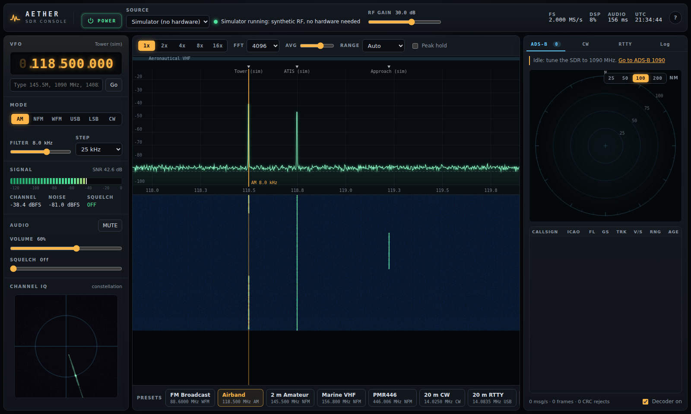

# Aether SDR Console



A browser front end for software-defined radio: a live spectrum and waterfall,
AM / NFM / WFM / USB / LSB / CW demodulation with audio, and built-in decoders for
**ADS-B**, **Morse (CW)** and **RTTY**. It uses plain JavaScript with no build step
and no external dependencies, so it works offline.

It runs from one of three sources:

| Source | What it is | Needs |
| --- | --- | --- |
| **Simulator** | A 2.0 MS/s synthetic RF feed containing broadcast FM, airband AM, marine and 2 m NFM, PMR446, CW, RTTY, SSB, APRS bursts and 8 ADS-B aircraft | Nothing |
| **rtl_tcp (network SDR)** | Live IQ from an RTL-SDR (or any server that speaks the rtl_tcp protocol) | `rtl_tcp` + the included bridge |
| **Audio input (any radio)** | Sound-card / line-in audio from any receiver, for CW and RTTY decoding | Microphone permission |

## Quick start

```bash
cd psloper            # repository root
python3 -m http.server 8080
```

Open <http://localhost:8080/sdr/> in a current Chrome, Edge, Firefox or Safari
browser, then press **POWER** (or Space). The simulator starts and every preset
along the bottom has live signals on it.

The page must be served over `http://localhost` (or HTTPS), not opened as a
`file://` path. It uses ES modules, a Web Worker and an AudioWorklet, and browsers
block those for local files.

## Using real hardware (RTL-SDR)

A web page cannot open a raw TCP socket, so a small bridge relays `rtl_tcp` over a
WebSocket. The bridge uses only the Python standard library.

```bash
rtl_tcp -a 127.0.0.1 -p 1234                  # terminal 1: the SDR server
python3 sdr/bridge/ws_tcp_bridge.py           # terminal 2: ws://127.0.0.1:8765 -> tcp 127.0.0.1:1234
```

In the console, choose **Source: rtl_tcp**, keep the bridge address
`ws://127.0.0.1:8765`, pick a sample rate and press **POWER**. The status line shows
the tuner type reported by `rtl_tcp` (for example "R820T tuner, 29 gain steps").

- **ADS-B** needs the sample rate at exactly **2.000 MS/s**. The ADS-B preset
  switches to it automatically.
- **HF presets (20 m)** need hardware that can tune HF. A standard RTL-SDR tunes
  from about 24 MHz upward and needs direct-sampling mode or an upconverter for HF.
- By default the bridge listens on `127.0.0.1` only and accepts pages served from
  localhost. `--host 0.0.0.0` and `--allow-any-origin` open it to your network;
  use them only on a network you trust.

## Controls

| Action | How |
| --- | --- |
| Tune | Click the spectrum or waterfall; scroll over it to step; arrow keys |
| Move the band | Drag the spectrum sideways |
| Change one digit | Scroll, or click the top/bottom half, of a VFO digit |
| Type a frequency | `F`, then e.g. `145.5M`, `1090 MHz`, `14083.5k` |
| Mode | Buttons, or keys `1`–`6` (AM, NFM, WFM, USB, LSB, CW) |
| Zoom | Zoom buttons, `Z`, or Shift+scroll |
| Mute / store memory / peak hold | `M` / `S` / `P` |

The **Mode** panel offers the usual mode for the band you are in (for example,
"Use AM" in the airband). Memories and settings are kept in this browser's local
storage only.

## Architecture

```
 UI thread (js/app.js)               DSP worker (js/dsp/worker.js)             Audio thread
 ─────────────────────               ─────────────────────────────             ────────────
 spectrum / waterfall  ◄─ spectrum ─ Source: Simulator | RtlTcpSource | mic
 VFO, S-meter, IQ      ◄─ meter, iq ─   │
 ADS-B air picture     ◄─ aircraft ──   ├─► SpectrumAnalyzer (FFT, averaging)
 CW / RTTY consoles    ◄─ text ──────   ├─► AdsbDemod ─► AircraftTracker (2 MS/s)
                                        └─► Receiver: NCO mix ─► FIR decimation
 controls ── tune / rx / gain ──►            ─► channel filter ─► demodulator
                                             ─► CW / RTTY decoders
                                             ─► audio FIR + resampler ── port ─► sdr-player
```

| Path | Role |
| --- | --- |
| `js/dsp/receiver.js` | Single-channel receiver: mixer, multi-stage decimation, channel filter, AM/FM/SSB/CW demodulation, AGC, squelch, and an audio resampler trimmed against the sound-card clock |
| `js/dsp/fft.js` | Radix-2 FFT and the averaging spectrum analyser (Blackman-Harris window, dBFS scale) |
| `js/dsp/filters.js` | Windowed-sinc FIR design, streaming decimating FIR, fractional resampler |
| `js/decoders/adsb.js` | Mode S DF17/18: preamble detection, CRC-24, identification, CPR position, velocity, tracker |
| `js/decoders/cw.js` | Goertzel tone detector, adaptive threshold and speed tracking |
| `js/decoders/rtty.js` | Two-tone FSK detector and asynchronous Baudot UART (USOS) |
| `js/sources/simulator.js` | Synthetic RF environment |
| `js/sources/rtltcp.js` | rtl_tcp protocol client over WebSocket |
| `js/audio/worklet.js` | Playback ring buffer and microphone capture processors |
| `bridge/ws_tcp_bridge.py` | WebSocket-to-TCP relay (standard library only) |

## Tests

```bash
cd sdr && node --test test/*.test.js
```

| Test file | What it checks |
| --- | --- |
| `adsb.test.js` | Decoder against published reference frames from J. Sun, *The 1090 MHz Riddle* (KLM1023 identification; position 52.2572 N, 3.9194 E at 38 000 ft; velocity 159 kt / 182.9° / −832 ft/min), CRC rejection, encoder round trip, PPM demodulation across block boundaries |
| `chain.test.js` | Simulator RF through the full receiver to CW, RTTY and ADS-B text, and that the chain runs faster than real time |
| `bridge.test.js` | Fake rtl_tcp server, then the Python bridge, then the client: header parse, byte-exact commands, IQ integrity, and the error shown when rtl_tcp is not running |

## Limits

- ADS-B covers airborne identification, position (barometric altitude) and velocity
  from DF17/18. It does not decode surface position, Comm-B, or Mode A/C, and it does
  not correct bit errors.
- WFM is mono. There is no stereo or RDS decoding.
- ACARS, VDL2, AIS, APRS and DAB are marked on the band plan but not decoded.
- S-meter readings are in dBFS (relative to the ADC's full scale), not calibrated dBm.
- The simulator's radio traffic is text-to-speech with fictional callsigns, not
  recordings of real transmissions. Its music is synthesised.

## Simulator speech

The spoken traffic (tower, approach, ATIS, marine, PMR, 2 m, SSB, talk radio) lives
in `js/sources/speech-clips.js` as 8 kHz, 8-bit clips. To change the phrases, edit
`PHRASES` in `tools/make_speech.py` and regenerate:

```bash
pip install piper-tts
python3 sdr/tools/make_speech.py --piper-model uk_male.onnx,uk_female.onnx,third_voice.onnx
```

Without Piper it falls back to eSpeak NG, eSpeak or Flite, which sound robotic. If
`speech-clips.js` is empty, the simulator falls back to its built-in tone voice.
